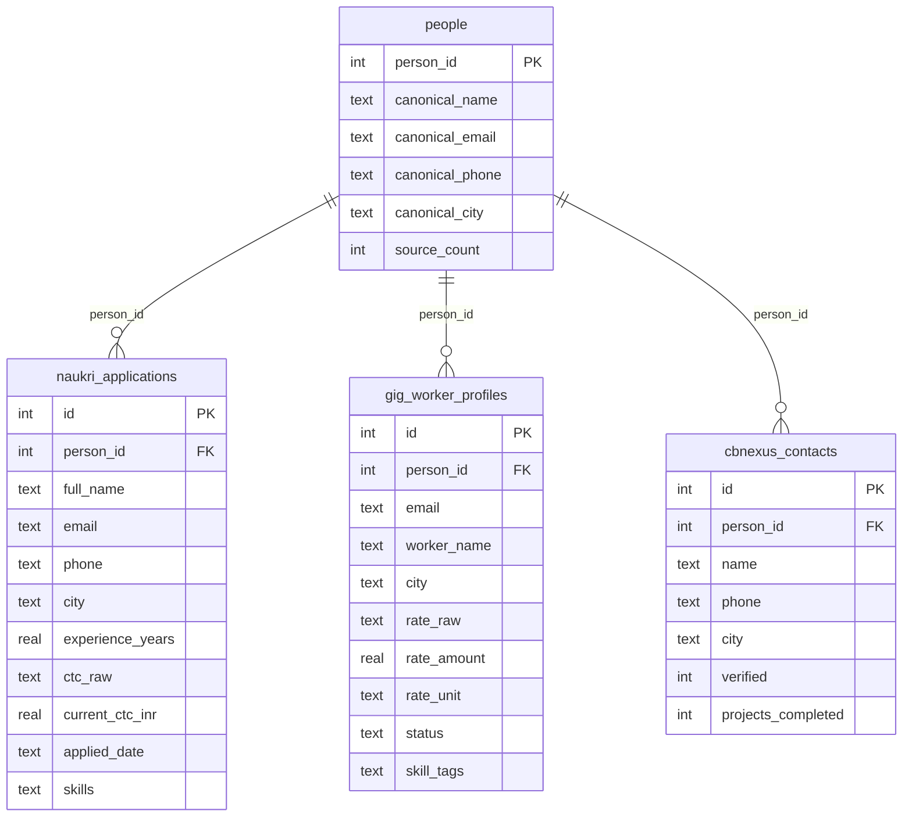

# ConsultBae — AI Automation Take-Home

Merges 3 messy CSVs from different systems into one SQLite database (deduplicating
people across files), builds one n8n automation on top of it, and a Streamlit app
for audio submission collection. Full brief:
[`data/ConsultBae - AI Automation Assignment.pdf`](data/ConsultBae%20-%20AI%20Automation%20Assignment.pdf).

## Repo structure

```
data/               3 raw source CSVs + assignment brief
task1_merge/        merge script + SQLite DB
task2_automation/   n8n flow export (JSON)
task3_audio_app/    Streamlit audio collection app
task4_report.md     data issues report (full detail below is a summary — see the file)
task5_stretch.md    scale/launch stretch answer
```

## Setup

Requires only Python 3 standard library — no `pip install` needed.

```
cd task1_merge
python pipeline.py
```

This reads the 3 CSVs from `data/`, prints the normalization log + match groups
+ merge summary to the console, and (re)builds `task1_merge/consultbae.db` from
scratch. Safe to re-run any time — it always rebuilds the DB rather than
appending to it.

**To review the result without any DB tool:** every table is also exported as
plain CSV at `task1_merge/exported_csv/` (`people.csv`,
`naukri_applications.csv`, `gig_worker_profiles.csv`, `cbnexus_contacts.csv`) —
regenerated on every `python pipeline.py` run, open directly in Excel/a text
editor.

**To query the DB directly:** this machine has no standalone `sqlite3` CLI
installed, but Python 3.12+ ships one built in — no install needed:
```
python -m sqlite3 task1_merge/consultbae.db "SELECT name FROM sqlite_master WHERE type='table';"

# how many people, and from how many sources each
python -m sqlite3 task1_merge/consultbae.db "SELECT source_count, COUNT(*) FROM people GROUP BY source_count;"

# the Arjun Mehta case: 3 separate people, none merged (see Matching Strategy)
python -m sqlite3 task1_merge/consultbae.db "SELECT * FROM people WHERE canonical_name = 'Arjun Mehta';"

# a person merged from all 3 sources, with their full history
python -m sqlite3 task1_merge/consultbae.db "SELECT * FROM naukri_applications WHERE person_id = 1;"
python -m sqlite3 task1_merge/consultbae.db "SELECT * FROM gig_worker_profiles WHERE person_id = 1;"
python -m sqlite3 task1_merge/consultbae.db "SELECT * FROM cbnexus_contacts WHERE person_id = 1;"
```
(If `sqlite3` is installed separately, `sqlite3 task1_merge/consultbae.db` also
works as a normal interactive shell with `.tables` / `.schema` dot-commands.)

## Data sources

### `source1_naukri_applicants.csv` — 42 rows

| Column | Type | Notes |
|---|---|---|
| Full Name | string | mixed casing, one abbreviated (`R. Verma`) |
| Email | string | 3 domains; lowercase in this file |
| Phone | string | 3 formats — see Matching Strategy below |
| City | string | casing/whitespace + real aliases (Gurgaon/Gurugram, Bangalore/Bengaluru) |
| Experience (Years) | float | clean |
| Current CTC | float/int | **mixed units** — raw rupees vs lakh-decimals |
| Applied Date | string | 4+ date formats mixed |
| Skills | string | comma list in one cell |

Duplicates: 2 pairs (4 rows) — see [task4_report.md](task4_report.md) #1–2.

### `source2_gig_workers.csv` — 32 raw rows (30 usable)

| Column | Type | Notes |
|---|---|---|
| email_id | string | mixed case |
| worker_name | string | mixed casing |
| rate | string | **mixed units** — `/hr` vs `k/month` |
| location | string | same city issues as source1 |
| status | string | mixed casing, 3 states (active/inactive/paused) |
| skill_tags | string | comma list, lowercase |

Row 12 is fully blank (dropped). Row 20 is a column-shifted duplicate of row 7
(dropped). No phone column at all in this file.

### `source3_cbnexus_contacts.csv` — 31 raw rows (30 usable)

| Column | Type | Notes |
|---|---|---|
| Name | string | ALL CAPS / Title Case mix |
| Phone Number | string | 3 formats — see Matching Strategy below |
| City | string | same casing/alias issues |
| Verified | string | `Y`/`N` vs `Yes`/`No` mixed |
| Projects Completed | int | clean |

Line 16 is the header row repeated as data (dropped). No email column at all in
this file. One unresolved ambiguity: two `Arjun Mehta` rows (5 and 28), same city,
different phone — see [task4_report.md](task4_report.md) #15.

**Full issue-by-issue detail (17 issues, all 3 files + cross-file):
[task4_report.md](task4_report.md).**

## Matching strategy (Task 1)

No field is common to all 3 files — source2 has no phone, source3 has no email —
so a single ID join is impossible by design.

**Approach: exact match on normalized email OR normalized phone**, connected via
union-find (two rows are the same person if their normalized email matches, or
their normalized phone matches; connected groups become one merged person). Name
is used only as a post-merge sanity check, never as a matching criterion.

- Phone normalization: strip all non-digit characters, then drop a leading `91`
  (12-digit case) or leading `0` (11-digit case), leaving a canonical 10-digit
  number.
- Email normalization: lowercase + trim.
- source1↔source2 link via email, source1↔source3 link via phone, source2↔source3
  only link transitively through a shared source1 row.

**Why not fuzzy name-matching:** every row here already carries at least one
reliable identifier (source1/source2 have email, source1/source3 have phone), so
nothing needs fuzzy help to be found. Fuzzy name matching would add a threshold to
justify while *increasing* risk — this dataset has repeated surnames (Mehta,
Chopra, Sharma, Bhatia) and two real `Arjun Mehta` rows with different phone
numbers that a lenient threshold could wrongly merge. Exact-match is simpler, has
a one-sentence explanation, and correctly leaves genuinely ambiguous cases
(Arjun Mehta x2, Deepak Nair x2) unmerged and flagged instead of silently guessed.

**Confirmed by running the pipeline:** 102 candidate rows (42 + 30 usable + 30
usable) resolve to **60 unique people** — 33 appeared in only one source, 27 were
merged from 2+ raw rows. 35 people ended up in exactly 1 source, 10 in exactly 2,
and 15 in all 3. The 3 raw `Arjun Mehta` rows resolved to **3 separate people**
(no shared field connects all of them) and the 2 `Deepak Nair` rows in source2
resolved to 2 separate people — exactly the outcome predicted by hand in
[task4_report.md](task4_report.md) #15 and #17, now verified programmatically.

### Database schema

One `people` identity table + one table per source, linked by `person_id`. A
person who wasn't found in a given source simply has no row in that source's
table — never a row full of nulls.

```
people                                naukri_applications  (source1)
├── person_id       PK                ├── person_id        FK
├── canonical_name                    ├── full_name, email, phone, city
├── canonical_email                   ├── experience_years
├── canonical_phone                   ├── ctc_raw, current_ctc_inr
├── canonical_city                    ├── applied_date
└── source_count    (1, 2, or 3)      └── skills

gig_worker_profiles  (source2)        cbnexus_contacts  (source3)
├── person_id        FK               ├── person_id         FK
├── email, worker_name, city          ├── name, phone, city
├── rate_raw, rate_amount, rate_unit  ├── verified
├── status                            └── projects_completed
└── skill_tags
```

A person can have more than one row in a source table (e.g. the two Nikhil
Chopra rows in source1, which are the same identity applying/appearing twice) —
identity is deduplicated at the `people` level; source-level history is not
collapsed or deleted.

**Entity-relationship diagram** (`people.person_id` is the primary key every
other table's `person_id` foreign-keys against — one identity, 0–N rows per
source):



**Exact `CREATE TABLE` statements used** (source of truth is the `SCHEMA`
constant in [`task1_merge/pipeline.py`](task1_merge/pipeline.py) — copied here
for quick reference):

```sql
CREATE TABLE people (
    person_id       INTEGER PRIMARY KEY,
    canonical_name  TEXT,
    canonical_email TEXT,
    canonical_phone TEXT,
    canonical_city  TEXT,
    source_count    INTEGER
);

CREATE TABLE naukri_applications (
    id                INTEGER PRIMARY KEY AUTOINCREMENT,
    person_id         INTEGER REFERENCES people(person_id),
    full_name         TEXT,
    email             TEXT,
    phone             TEXT,
    city              TEXT,
    experience_years  REAL,
    ctc_raw           TEXT,
    current_ctc_inr   REAL,
    applied_date      TEXT,
    skills            TEXT
);

CREATE TABLE gig_worker_profiles (
    id           INTEGER PRIMARY KEY AUTOINCREMENT,
    person_id    INTEGER REFERENCES people(person_id),
    email        TEXT,
    worker_name  TEXT,
    city         TEXT,
    rate_raw     TEXT,
    rate_amount  REAL,
    rate_unit    TEXT,
    status       TEXT,
    skill_tags   TEXT
);

CREATE TABLE cbnexus_contacts (
    id                  INTEGER PRIMARY KEY AUTOINCREMENT,
    person_id           INTEGER REFERENCES people(person_id),
    name                TEXT,
    phone               TEXT,
    city                TEXT,
    verified            INTEGER,
    projects_completed  INTEGER
);
```

## Task 2 — n8n Automation

**Own-idea pick** (the brief's third option: *"your own idea of similar
scope — surprise us"*), not the duplicate-alert or skill-tagging templates
verbatim — though it does include LLM-based skill tagging as one step.
**Talent Insights — CSV Analyzer**: upload an applicants CSV to a public
n8n form, get a full visual talent-analysis report back on the same page a
few seconds later — no email, no credentials to configure beyond n8n's own
free OpenAI connection.

**Live form:** https://shreyasingh.app.n8n.cloud/form/talent-insights
**Exported flow:** [`task2_automation/Talent Insights - CSV Analyzer.json`](task2_automation/Talent%20Insights%20-%20CSV%20Analyzer.json)

### Flow

```
On CSV Upload (form trigger)
  -> Parse CSV (Extract From File)
  -> Compute Stats (Code node)
  -> Tag Skills & Insights (LLM chain, gpt-5-mini + structured output parser)
  -> Build Report (Code node - HTML + QuickChart chart images)
  -> Show Report (form completion page)
```

### What it does

- **Compute Stats** normalizes the same kind of messiness Task 1 deals
  with: CTC in mixed units (raw INR vs. lakh-decimals like `4.2` →
  ₹4,20,000), inconsistent city casing/aliases (`GURGAON`/`gurugram` →
  `Gurugram`), skills split into per-skill counts — plus totals, avg/median/
  min/max CTC, average experience, experience bands, top skills, and city
  distribution.
- **Tag Skills & Insights** sends the computed stats + a compact per-
  applicant list to an LLM (n8n's free OpenAI credits), which assigns each
  applicant to one of 9 fixed skill categories (Web Development, AI
  Automation, Python Developer, etc.), computes the category distribution,
  and writes a short recruiter-facing narrative — returned as validated
  structured JSON via an output parser, not free-form text.
- **Build Report** renders everything into a styled HTML report - KPI stat
  cards, a doughnut chart (skill categories), bar charts (top skills,
  experience bands), a pie chart (city distribution), and a tagged-
  applicant table - using QuickChart (chart-as-a-URL, no extra credential)
  so the whole flow stays zero-config beyond the one LLM connection.
- **Show Report** displays that HTML directly on the form's own completion
  page - the uploader never leaves the browser tab.

### Design decisions

- **No email/SMTP step, deliberately removed.** The first draft delivered
  the report by email and required configuring SMTP credentials - rejected
  as unnecessary complexity for what's fundamentally a synchronous
  request/response (upload, wait a few seconds, see the result). Simplified
  to `responseMode: lastNode` showing the report on the form's own result
  page - zero credentials beyond the LLM connection, matching the same
  "don't over-engineer" instinct used throughout this project.
- **`gpt-5-mini`, not `gpt-4o-mini`.** The free OpenAI credits n8n provisions
  don't include access to the 4o model family - swapped models to match
  what the actual credential supports rather than leaving a broken
  reference.
- **Structured output parser for the LLM step**, not parsing free-form text
  - the categorization and narrative come back as validated JSON matching a
  fixed schema, so `Build Report` can index straight into
  `parsed.tagged`/`parsed.category_distribution` without fragile text
  parsing.
- **CSV upload, not a live DB query against `consultbae.db`.** Worth being
  upfront about: this flow analyzes *whatever CSV someone uploads*, it
  doesn't read Task 1's merged `people` table directly. That's a reasonable
  reading of "your own idea of similar scope," but if asked live, the
  honest answer is that a version reading directly from
  `task1_merge/consultbae.db` (via an n8n SQLite/HTTP node) would tie the
  two tasks together more tightly - not built here to keep the flow at
  zero-config (no DB connection string to manage in n8n).

---

## Task 3 — Audio Submission App

A Streamlit app where someone enters name + phone, records in-browser
(`st.audio_input`) or uploads a file, and gets a `submissions` row added to the
**same** `consultbae.db` from Task 1 — linked to an existing `people` row if
their phone matches one, or a brand-new one if it doesn't.

**Live demo:** https://audioappconsultbae.streamlit.app/ — this deployed
instance's submissions won't survive a redeploy — see Task 5.

### Setup

Unlike Task 1 (zero dependencies by design), Task 3 has real dependencies, so
it gets its own virtual environment:

```
cd task3_audio_app
python -m venv venv
venv\Scripts\python.exe -m pip install -r requirements.txt
venv\Scripts\streamlit.exe run app.py
```

(Calling `venv\Scripts\streamlit.exe` directly avoids PowerShell's script
execution-policy prompt that `venv\Scripts\Activate.ps1` can trigger — if you'd
rather activate normally, `venv\Scripts\Activate.ps1` then plain `streamlit run
app.py` works too, once execution policy allows it.)

Requires `ffmpeg` on PATH (used by `pydub` to decode WAV/MP3/WEBM-Opus/OGG
uniformly, and by `ffprobe` — bundled with `ffmpeg` — to read real bitrate).
Second view (submissions list) is at the "View Submissions" page in the
sidebar once the app is running.

### Schema — `submissions` table

```sql
CREATE TABLE IF NOT EXISTS submissions (
    submission_id     INTEGER PRIMARY KEY AUTOINCREMENT,
    person_id         INTEGER NOT NULL REFERENCES people(person_id),
    audio_path        TEXT NOT NULL,
    original_filename TEXT,
    audio_format      TEXT,
    duration_sec      REAL,
    sample_rate_hz    INTEGER,
    bitrate_kbps      REAL,
    loudness_dbfs     REAL,
    quality_label     TEXT,
    submitted_at      TEXT NOT NULL
);
```

`submission_id` is the PK — one person can submit many recordings, so this is
one-to-many, same shape as `naukri_applications` allowing 2 rows for Nikhil
Chopra. `person_id` is the FK into Task 1's `people` table — **not** phone;
phone is only the lookup key used at insert time (via the exact same
`normalize_phone()` from `pipeline.py`, imported directly rather than
re-implemented, so the two tasks can never normalize the same real number
differently).

**Insert flow:** normalize the entered phone → `SELECT person_id FROM people
WHERE canonical_phone = ?` → match found: reuse that `person_id`, `people` row
untouched (including its real `source_count` from Task 1) → no match: insert a
new `people` row with `source_count = 0`, a value Task 1's own pipeline can
never produce (every person it creates came from ≥1 of the 3 CSVs), so `0`
unambiguously flags "known only via the audio channel."

### Design decisions

- **Bitrate via `ffprobe`, not a formula.** `sample_rate × bit_depth ×
  channels` only gives the right answer for uncompressed WAV — for MP3/WEBM
  the real bitrate is whatever the codec was encoded at, which isn't
  derivable from sample rate. Reading `ffprobe`'s actual container metadata
  avoids reporting a wildly wrong number for compressed uploads (verified:
  the same clip is ~706 kbps as WAV vs. ~69 kbps as a 64kbps-target MP3).
- **Loudness clamped, not `-inf`.** A truly silent clip makes pydub's
  `.dBFS` return `float('-inf')`, which is awkward to store/compare in
  SQLite — clamped to a documented `-100.0` sentinel floor instead.
- **Quality/noise estimate (bonus) is rule-based**: whole-clip average
  loudness below -30 dBFS → `"silent"`; otherwise, crest factor (peak-to-
  average loudness gap across 100ms windows) below 15.0 → `"noisy"` (a flat,
  low-dynamic-range profile more typical of constant background noise than
  speech); else `"good"`. Both thresholds were calibrated against 5 real
  test recordings, not guessed — see stuck log #5. Known limitation stated
  plainly in the code: this detects *silent* and *flat/noisy*, not
  *unclear/mumbled* speech — that's a frequency-domain question a loudness
  heuristic can't see.
- **Extraction happens before any DB write.** A file that fails to decode
  (`UnsupportedAudioError`) never reaches the database — no half-written
  rows.

## Stuck log

*(Filled in as I actually get stuck — not pre-written. 2-3 hardest places, what I
searched, what I asked AI, what I rejected and why.)*

1. **Understanding how matching actually merges 3 files with no common ID.** I
   understood the individual pieces (normalize phone, normalize email) but got
   stuck on the mechanics — whether matching should be sequential joins
   (source1→source2, then merge that result with source3) or something else, and
   how two rows that never directly matched each other could still end up as one
   person. I asked Claude to walk through real rows from my own data (the Nikhil
   Chopra alt-email duplicate, the 3 unmerged Arjun Mehtas) plus hypotheticals I
   made up myself to stress-test it. The unlock was union-find/connected-components:
   build every match edge (same normalized email OR phone) across all rows from
   all 3 files at once, and a row joins a group by matching *any* existing member
   of that group, not just the original row it was compared to — which is why
   order doesn't matter and why matches can "absorb" transitively. I didn't reject
   anything suggested here, but I deliberately invented my own edge cases before
   accepting the approach, since a naive sequential-join order would silently give
   different (wrong) groupings depending on which file got joined first.
2. **Why the match key is email/phone alone, not email+name or phone+name.** My
   instinct was that a compound key (e.g. `email + name`) would be safer than
   matching on email or phone alone, since it feels like more evidence required
   before merging two records. I asked Claude to check this against my own data,
   and the "R. Verma" / "Rohit Verma" pair in source1 (rows 25 and 31 — identical
   email and phone, completely different name strings) disproved it immediately:
   requiring name to also match would have silently failed to merge a pair I
   already knew was the same person, since name *format* varies (abbreviations,
   ALL CAPS in source3) even when identity doesn't. I accepted dropping name from
   the match key after confirming there's no case in the actual 27 merged groups
   where email/phone matched but the names looked like genuinely different
   people — so a compound key would only have cost real matches, not prevented
   any false ones; name is instead surfaced in the console output for a human to
   eyeball, not used to gate the merge itself.
3. **Why not skip the Python matching code entirely and just run a `FULL OUTER
   JOIN` across the 3 tables on `(email, phone, name)`?** This looked like it
   should work — SQLite supports `FULL OUTER JOIN`, and a composite key felt
   like "more evidence" for a match. Two things killed it once I traced it
   through on my own data:

   ```
   source1 row27: email=alt.nikhil.chopra70@...   phone=9000000103
   source1 row37: email=nikhil.chopra70@...       phone=9000000103

   A join chain like:
     source1 FULL OUTER JOIN source2 ON email
     source1 FULL OUTER JOIN source3 ON phone
   never compares row27 to row37 - both rows are in source1 itself, and a join
   across source1/source2/source3 has no step that self-compares source1
   against source1. The Nikhil Chopra duplicate is invisible to this query
   no matter how the ON clauses are written.
   ```

   First, requiring `name` in the key breaks the same way it did with
   email+name (R. Verma vs Rohit Verma), and `phone`/`email` are `NULL` for 2 of
   3 files each, so `t1.phone = t3.phone` never even evaluates true where one
   side is missing the column. Second, and less obvious: joins are pairwise and
   don't propagate — Tanvi Gupta only merges across all 3 files because source1
   is a *bridge* (matches source2 on email, source3 on phone), and no fixed
   join order can express "keep following matches transitively, however many
   hops it takes" the way the union-find graph does. Concluded a recursive CTE
   could theoretically replicate it in pure SQL, but that's the same
   connected-components idea written declaratively — more code to defend for no
   behavior difference, so kept the ~15-line Python `UnionFind` class instead.
4. **Task 1's pipeline would have silently destroyed every Task 3 submission
   on re-run.** While wiring up Task 3's `db.py` to share the exact same
   `consultbae.db` file, I traced through what `pipeline.py`'s
   `build_database()` actually does and noticed it called `DB_PATH.unlink()`
   to force a clean rebuild every run — meaning re-running `python
   pipeline.py` after Task 3 already had submissions in the database would
   delete the entire file and rebuild it from scratch, taking every recorded
   audio submission with it. Caught this by reasoning through what happens
   when two tasks share one file, before it ever caused real data loss, not
   from an error message. Fixed by having `build_database()` `DROP TABLE IF
   EXISTS` only the 4 tables Task 1 itself owns (`people`,
   `naukri_applications`, `gig_worker_profiles`, `cbnexus_contacts`) instead
   of deleting the whole file — verified by inserting a test submission,
   re-running `pipeline.py`, and confirming both the submission and the
   original `person_id` assignments (e.g. `person_id=1` still resolving to
   Tanvi Gupta) survived intact.
5. **The quality/noise bonus label showed "good" for every single
   submission, even a clip I deliberately recorded half-silent.** Tested the
   app live with 5 real recordings, including one 10.7s clip I stayed
   silent for roughly half of - it still came back `"good"`. Rather than
   guess at new numbers, I had Claude pull the actual saved `.wav` files
   from `uploads/` and print their real windowed loudness distributions.
   That showed two compounding calibration mistakes: the silence check
   required 90% of 100ms windows below -50 dBFS to fire, but even my
   deliberately-silent clip only hit 52% (real "silence" through a laptop
   mic still registers around -55 to -65 dBFS in short bursts, not solid
   near-total silence) - so the ratio bar was unreachable in practice; and
   separately, the "noisy" crest-factor threshold (6.0) was *lower* than
   every one of the 5 real clips' actual values (16.5-34.1), because normal
   speech has a lot of natural dynamic range between loud syllables and
   quiet gaps - meaning nothing could ever have scored "noisy" either.
   Fixed by switching the silence check to whole-clip average loudness
   (`< -30 dBFS`, which cleanly separates the -35.4 dBFS silent clip from
   the -23 to -28 dBFS normal ones) and raising the crest-factor threshold
   to 15.0 (below all 5 real clean samples). Re-ran extraction on the same
   5 saved files afterward to confirm the fix against real data rather than
   just trusting the new numbers - the silent clip now correctly reads
   `"silent"`, the other 4 stay `"good"`. Also had this confirmed
   independently: a synthetic pure sine tone (constant amplitude, zero
   natural dynamics) correctly scores `"noisy"` under the new threshold - a
   clean example of exactly what crest factor is meant to catch.
6. **Rejected the first Task 2 draft for being over-engineered.** The
   initial n8n flow delivered the talent report by email, which meant
   configuring SMTP credentials and adding an email field to the intake
   form. Pushed back immediately - didn't want to manage SMTP for something
   that's really just "upload, wait a few seconds, see a result," and said
   so plainly rather than accepting the more complex default. Rebuilt as a
   straight line ending in the form's own completion page instead - no
   SMTP node, no email credential, no email field - zero configuration
   beyond n8n's existing OpenAI connection. Same "don't over-engineer"
   instinct applied throughout Task 1 and Task 3, just caught at the
   design-review stage instead of after building it.
7. **A visuals complaint surfaced a separate, real bug.** Asked for the
   report to have actual charts instead of "plain bland insights" - while
   that was being rebuilt, the average-experience stat came back as
   `"0.33 yrs"`, obviously wrong for applicant data that averages roughly
   3.5-4 years. That turned out to be a genuine bug in the averaging
   formula inside the Compute Stats code node, not a data issue - fixed and
   shipped in the same pass as the chart rework. Same lesson as the Task 3
   quality-label bug: a number that returns without erroring isn't the same
   as a number that's correct, and it only gets caught by actually looking
   at the output against data you already know the rough shape of.
