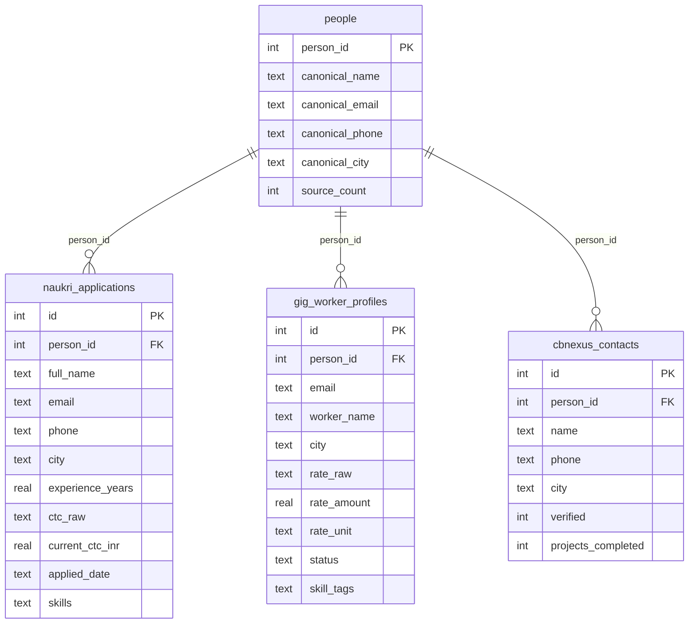

# ConsultBae — AI Automation Take-Home

Merges 3 messy CSVs from different systems into one SQLite database (deduplicating
people across files), builds one n8n automation on top of it, and a Streamlit app
for audio submission collection. Full brief:
[`data/ConsultBae - AI Automation Assignment.pdf`](data/ConsultBae%20-%20AI%20Automation%20Assignment.pdf).

## Repo structure

```
data/               3 raw source CSVs + assignment brief
task1_merge/        merge script + SQLite DB
task2_automation/   n8n flow export (JSON)
task3_audio_app/    Streamlit audio collection app
task4_report.md     data issues report (full detail below is a summary — see the file)
task5_stretch.md    scale/launch stretch answer
```

## Setup

Requires only Python 3 standard library — no `pip install` needed.

```
cd task1_merge
python pipeline.py
```

This reads the 3 CSVs from `data/`, prints the normalization log + match groups
+ merge summary to the console, and (re)builds `task1_merge/consultbae.db` from
scratch. Safe to re-run any time — it always rebuilds the DB rather than
appending to it.

**To review the result without any DB tool:** every table is also exported as
plain CSV at `task1_merge/exported_csv/` (`people.csv`,
`naukri_applications.csv`, `gig_worker_profiles.csv`, `cbnexus_contacts.csv`) —
regenerated on every `python pipeline.py` run, open directly in Excel/a text
editor.

**To query the DB directly:** this machine has no standalone `sqlite3` CLI
installed, but Python 3.12+ ships one built in — no install needed:
```
python -m sqlite3 task1_merge/consultbae.db "SELECT name FROM sqlite_master WHERE type='table';"

# how many people, and from how many sources each
python -m sqlite3 task1_merge/consultbae.db "SELECT source_count, COUNT(*) FROM people GROUP BY source_count;"

# the Arjun Mehta case: 3 separate people, none merged (see Matching Strategy)
python -m sqlite3 task1_merge/consultbae.db "SELECT * FROM people WHERE canonical_name = 'Arjun Mehta';"

# a person merged from all 3 sources, with their full history
python -m sqlite3 task1_merge/consultbae.db "SELECT * FROM naukri_applications WHERE person_id = 1;"
python -m sqlite3 task1_merge/consultbae.db "SELECT * FROM gig_worker_profiles WHERE person_id = 1;"
python -m sqlite3 task1_merge/consultbae.db "SELECT * FROM cbnexus_contacts WHERE person_id = 1;"
```
(If `sqlite3` is installed separately, `sqlite3 task1_merge/consultbae.db` also
works as a normal interactive shell with `.tables` / `.schema` dot-commands.)

## Data sources

### `source1_naukri_applicants.csv` — 42 rows

| Column | Type | Notes |
|---|---|---|
| Full Name | string | mixed casing, one abbreviated (`R. Verma`) |
| Email | string | 3 domains; lowercase in this file |
| Phone | string | 3 formats — see Matching Strategy below |
| City | string | casing/whitespace + real aliases (Gurgaon/Gurugram, Bangalore/Bengaluru) |
| Experience (Years) | float | clean |
| Current CTC | float/int | **mixed units** — raw rupees vs lakh-decimals |
| Applied Date | string | 4+ date formats mixed |
| Skills | string | comma list in one cell |

Duplicates: 2 pairs (4 rows) — see [task4_report.md](task4_report.md) #1–2.

### `source2_gig_workers.csv` — 32 raw rows (30 usable)

| Column | Type | Notes |
|---|---|---|
| email_id | string | mixed case |
| worker_name | string | mixed casing |
| rate | string | **mixed units** — `/hr` vs `k/month` |
| location | string | same city issues as source1 |
| status | string | mixed casing, 3 states (active/inactive/paused) |
| skill_tags | string | comma list, lowercase |

Row 12 is fully blank (dropped). Row 20 is a column-shifted duplicate of row 7
(dropped). No phone column at all in this file.

### `source3_cbnexus_contacts.csv` — 31 raw rows (30 usable)

| Column | Type | Notes |
|---|---|---|
| Name | string | ALL CAPS / Title Case mix |
| Phone Number | string | 3 formats — see Matching Strategy below |
| City | string | same casing/alias issues |
| Verified | string | `Y`/`N` vs `Yes`/`No` mixed |
| Projects Completed | int | clean |

Line 16 is the header row repeated as data (dropped). No email column at all in
this file. One unresolved ambiguity: two `Arjun Mehta` rows (5 and 28), same city,
different phone — see [task4_report.md](task4_report.md) #15.

**Full issue-by-issue detail (17 issues, all 3 files + cross-file):
[task4_report.md](task4_report.md).**

## Matching strategy (Task 1)

No field is common to all 3 files — source2 has no phone, source3 has no email —
so a single ID join is impossible by design.

**Approach: exact match on normalized email OR normalized phone**, connected via
union-find (two rows are the same person if their normalized email matches, or
their normalized phone matches; connected groups become one merged person). Name
is used only as a post-merge sanity check, never as a matching criterion.

- Phone normalization: strip all non-digit characters, then drop a leading `91`
  (12-digit case) or leading `0` (11-digit case), leaving a canonical 10-digit
  number.
- Email normalization: lowercase + trim.
- source1↔source2 link via email, source1↔source3 link via phone, source2↔source3
  only link transitively through a shared source1 row.

**Why not fuzzy name-matching:** every row here already carries at least one
reliable identifier (source1/source2 have email, source1/source3 have phone), so
nothing needs fuzzy help to be found. Fuzzy name matching would add a threshold to
justify while *increasing* risk — this dataset has repeated surnames (Mehta,
Chopra, Sharma, Bhatia) and two real `Arjun Mehta` rows with different phone
numbers that a lenient threshold could wrongly merge. Exact-match is simpler, has
a one-sentence explanation, and correctly leaves genuinely ambiguous cases
(Arjun Mehta x2, Deepak Nair x2) unmerged and flagged instead of silently guessed.

**Confirmed by running the pipeline:** 102 candidate rows (42 + 30 usable + 30
usable) resolve to **60 unique people** — 33 appeared in only one source, 27 were
merged from 2+ raw rows. 35 people ended up in exactly 1 source, 10 in exactly 2,
and 15 in all 3. The 3 raw `Arjun Mehta` rows resolved to **3 separate people**
(no shared field connects all of them) and the 2 `Deepak Nair` rows in source2
resolved to 2 separate people — exactly the outcome predicted by hand in
[task4_report.md](task4_report.md) #15 and #17, now verified programmatically.

### Database schema

One `people` identity table + one table per source, linked by `person_id`. A
person who wasn't found in a given source simply has no row in that source's
table — never a row full of nulls.

```
people                                naukri_applications  (source1)
├── person_id       PK                ├── person_id        FK
├── canonical_name                    ├── full_name, email, phone, city
├── canonical_email                   ├── experience_years
├── canonical_phone                   ├── ctc_raw, current_ctc_inr
├── canonical_city                    ├── applied_date
└── source_count    (1, 2, or 3)      └── skills

gig_worker_profiles  (source2)        cbnexus_contacts  (source3)
├── person_id        FK               ├── person_id         FK
├── email, worker_name, city          ├── name, phone, city
├── rate_raw, rate_amount, rate_unit  ├── verified
├── status                            └── projects_completed
└── skill_tags
```

A person can have more than one row in a source table (e.g. the two Nikhil
Chopra rows in source1, which are the same identity applying/appearing twice) —
identity is deduplicated at the `people` level; source-level history is not
collapsed or deleted.

**Entity-relationship diagram** (`people.person_id` is the primary key every
other table's `person_id` foreign-keys against — one identity, 0–N rows per
source):



**Exact `CREATE TABLE` statements used** (source of truth is the `SCHEMA`
constant in [`task1_merge/pipeline.py`](task1_merge/pipeline.py) — copied here
for quick reference):

```sql
CREATE TABLE people (
    person_id       INTEGER PRIMARY KEY,
    canonical_name  TEXT,
    canonical_email TEXT,
    canonical_phone TEXT,
    canonical_city  TEXT,
    source_count    INTEGER
);

CREATE TABLE naukri_applications (
    id                INTEGER PRIMARY KEY AUTOINCREMENT,
    person_id         INTEGER REFERENCES people(person_id),
    full_name         TEXT,
    email             TEXT,
    phone             TEXT,
    city              TEXT,
    experience_years  REAL,
    ctc_raw           TEXT,
    current_ctc_inr   REAL,
    applied_date      TEXT,
    skills            TEXT
);

CREATE TABLE gig_worker_profiles (
    id           INTEGER PRIMARY KEY AUTOINCREMENT,
    person_id    INTEGER REFERENCES people(person_id),
    email        TEXT,
    worker_name  TEXT,
    city         TEXT,
    rate_raw     TEXT,
    rate_amount  REAL,
    rate_unit    TEXT,
    status       TEXT,
    skill_tags   TEXT
);

CREATE TABLE cbnexus_contacts (
    id                  INTEGER PRIMARY KEY AUTOINCREMENT,
    person_id           INTEGER REFERENCES people(person_id),
    name                TEXT,
    phone               TEXT,
    city                TEXT,
    verified            INTEGER,
    projects_completed  INTEGER
);
```

## Stuck log

*(Filled in as I actually get stuck — not pre-written. 2-3 hardest places, what I
searched, what I asked AI, what I rejected and why.)*

1. **Understanding how matching actually merges 3 files with no common ID.** I
   understood the individual pieces (normalize phone, normalize email) but got
   stuck on the mechanics — whether matching should be sequential joins
   (source1→source2, then merge that result with source3) or something else, and
   how two rows that never directly matched each other could still end up as one
   person. I asked Claude to walk through real rows from my own data (the Nikhil
   Chopra alt-email duplicate, the 3 unmerged Arjun Mehtas) plus hypotheticals I
   made up myself to stress-test it. The unlock was union-find/connected-components:
   build every match edge (same normalized email OR phone) across all rows from
   all 3 files at once, and a row joins a group by matching *any* existing member
   of that group, not just the original row it was compared to — which is why
   order doesn't matter and why matches can "absorb" transitively. I didn't reject
   anything suggested here, but I deliberately invented my own edge cases before
   accepting the approach, since a naive sequential-join order would silently give
   different (wrong) groupings depending on which file got joined first.
2. **Why the match key is email/phone alone, not email+name or phone+name.** My
   instinct was that a compound key (e.g. `email + name`) would be safer than
   matching on email or phone alone, since it feels like more evidence required
   before merging two records. I asked Claude to check this against my own data,
   and the "R. Verma" / "Rohit Verma" pair in source1 (rows 25 and 31 — identical
   email and phone, completely different name strings) disproved it immediately:
   requiring name to also match would have silently failed to merge a pair I
   already knew was the same person, since name *format* varies (abbreviations,
   ALL CAPS in source3) even when identity doesn't. I accepted dropping name from
   the match key after confirming there's no case in the actual 27 merged groups
   where email/phone matched but the names looked like genuinely different
   people — so a compound key would only have cost real matches, not prevented
   any false ones; name is instead surfaced in the console output for a human to
   eyeball, not used to gate the merge itself.
3. TBD
